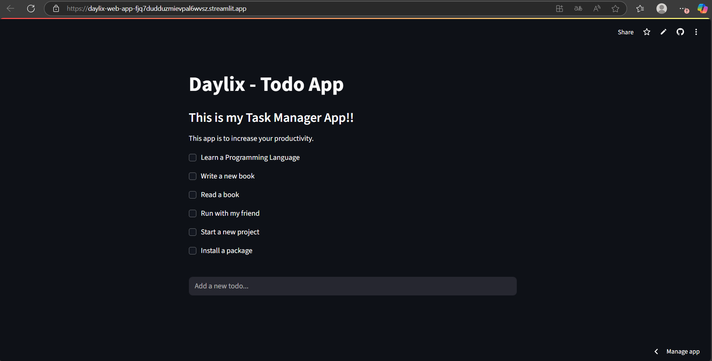

# Projeto Daylix: To-Do List📝
#### Gerenciador de Tarefas (Terminal + GUI + Web App)

### 🚀 Deploy
👉 [Acesse o Daylix Web App online](https://daylix-web-app-fjq7dudduzmievpal6wvsz.streamlit.app/)

---


Daylix é um gerenciador de tarefas simples que utiliza estrutura de dados e manipulação de arquivos `.txt` para armazenar informações.  
O projeto possui três modos de uso:

1. **Modo Terminal (CLI)**: gerencia tarefas pelo terminal.  
2. **Modo Gráfico (GUI)**: interface simples usando FreeSimpleGUI.  
3. **Web App (Streamlit)**: interface web interativa para gerenciar tarefas no navegador.

### Funcionalidades
#### Modo Terminal
- ➕`add [tarefa]`
- 📄`show`
- 📝`edit [número]`
- ✅`complete [número]`
- ❌`exit`

#### Modo Gráfico (GUI)
- Adicionar tarefas via campo de texto
- Editar tarefas existentes
- Concluir tarefas e removê-las da lista

#### Web App (Streamlit)
- Adicionar tarefas via campo de texto
- Concluir tarefas clicando nas checkboxes
- Lista de tarefas atualizada dinamicamente

### 🗂️ Estrutura do Projeto
- `main.py`: código principal (loop de interação com o usuário)
- `functions.py`: funções para ler/escrever tarefas
- `todos.txt`: arquivo para salvar as tarefas
- `gui.py`: interface gráfica
- `web.py`: web app


### 🧱 Estrutura do Código
O código está organizado com funções para:
* `get_todos(filepath=FILEPATH)`: lê as tarefas do arquivo (default `"todos.txt"`) e retorna uma lista
* `write_todos(todos, filepath=FILEPATH)`: salva a lista de tarefas no arquivo (default `"todos.txt"`)

---

### 🛠️ Tecnologias Utilizadas
- **Python 3.13.2**
- **FreeSimpleGUI (GUI)**
- **Streamlit (Web App)**
- **Git & GitHub**

---

### 📚 Aprendizados
O projeto Daylix me ajudou a aprender e praticar:
- Estruturação de projetos em Python
- Uso de Git e GitHub
- Versionamento e práticas de commits
- Criação de interfaces diferentes (CLI, GUI, Web)
- Deploy de aplicações na nuvem

---

### Como usar (GUI)
1. Clone o repositório.
2. Instale a dependência FreeSimpleGUI, caso ainda não tenha.
3. Execute o arquivo gui.py no Python.

### Como usar (Web App)
*Existem 2 maneiras de utilizar o Daylix Web App:*
1. **Você pode acessar o projeto diretamente pelo link, sem precisar instalar nada:**

👉 [Acesse aqui o Daylix](https://daylix-web-app-fjq7dudduzmievpal6wvsz.streamlit.app/)

2. **Rodando localmente (opcional)**

Se quiser testar o app na sua máquina, siga os seguintes comandos:

```bash
git clone https://github.com/gabriel-oligom/daylix-web-app
cd daylix-web-app
python -m venv venv        # cria ambiente virtual
source venv/bin/activate   # Linux/Mac
venv\Scripts\activate      # Windows
pip install -r requirements.txt
streamlit run web.py
```

### 📸 Preview do Daylix Web App

